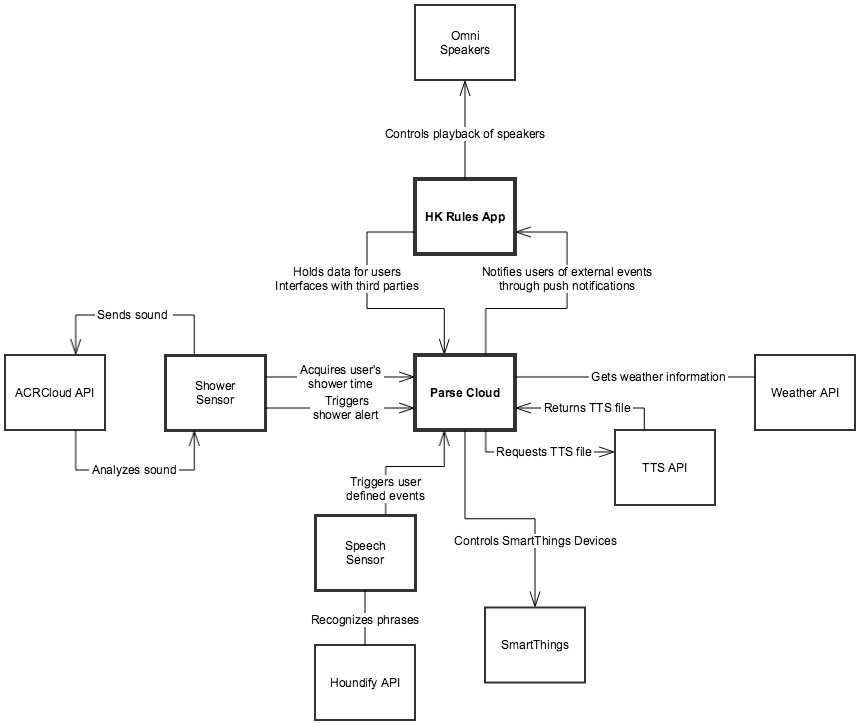

Welcome to HKIoTDemo's documentation!
=====================================

Welcome to our demo on how the Harman Wireless HD Audio System can be integrated into the Internet of Things. The `Wireless HD Audio SDK <http://developer.harman.com>`__ allows one to develop applications that connect HD Wireless speakers to other devices in the home.

The entities involved in this demo are:

*HK Rules Application*
	iOS application that functions as a central hub for interfacing with the Harman speakers. 
*Parse Cloud*
	Backend architecture for IoT functionality, and interfaces with third parties.
*Shower Sensor* 
	iOS application representing a sensor in the home (specifically detecting the lengths of showers)
*Speech Sensor*
	iOS application representing a voice recognition sensor 
*`SmartThings <http://www.smartthings.com/developers/>`__*
	Third party IoT devices such as contact sensors, temperature sensors, etc 

Contents:

Overview of Classes 
~~~~~~~~~~~~~~~~~~~~

.. toctree::
   :maxdepth: 2

   modules

Wake Up Scenario
~~~~~~~~~~~~~~~~~

.. toctree::
   :maxdepth: 2

   wakeup

