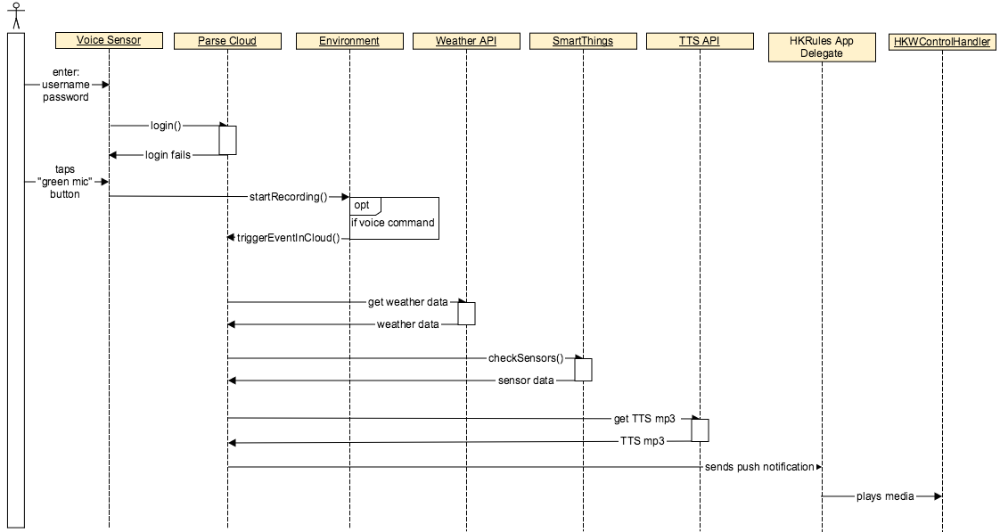

Leave House Scenario
====================

The "Leave House" scenario is the last scenario of our IoT demo. When you are about to leave the house for work or maybe even for a party, it'd be nice for an update as to how your house is looking in terms of security, or whether or not you should bring an umbrella or wear shorts due to weather. That is what this scene represents. You're notified of your home security, as well as given a weather update as you leave for the door. 

We also did not have a voice recoginization sensor of our own, so we had to emulate that feature as well. Using Houndify API did exactly what we wanted, and was very glad to have got that working. 

The 3rd party things we used for this scenario are:

*Houndify API*
	for speech recognization. We needed it to differentiate phrases from the user.  
*Weather API*
	for weather forecase notification. 
*Text-To-Speech API*
	for converting an text to speech to play back through the speaker.

We will be leading you through the Leave House Scenario in the best way that we can. The numbers correspond to the numbering on the sequence diagram below.

Sequence Diagram
~~~~~~~~~~~~~~~~

**Have trouble seeing the diagram?** `Click Here! <http://hkiotdemo.readthedocs.org/en/latest/_images/leavesd.png>`__ 

Initial Setup
~~~~~~~~~~~~~

1. The user enters their username and password into the Voice Sensor and logs in to Parse, so the Voice Sensor knows which user to send push notifications to.

Using the Voice Sensor
~~~~~~~~~~~~~~~~~~~~~~

2. The user taps the green microphone button on the voice sensor, and if the button turns red, then the sensor is recording. If the voice sensor hears a voice command, it will trigger an event in the Parse Cloud.

3. When Parse receives a notification from the voice sensor that a voice command was given (namely "I'm leaving"), Parse collects weather data, checks the house's security sensors, and compiles that information into a TTS message which it sends in a push notification to the HKRules AppDelegate running on the user's iOS device.

4. When the HKRules AppDelegate receives the push notification, it plays the TTS message through the Harman speakers.

And there we go! That concludes Leave House Scenario, and completes our IoT Demostration! We hope you guys were able to get it up and running, and we hoped we were able to help guide you through the process. 