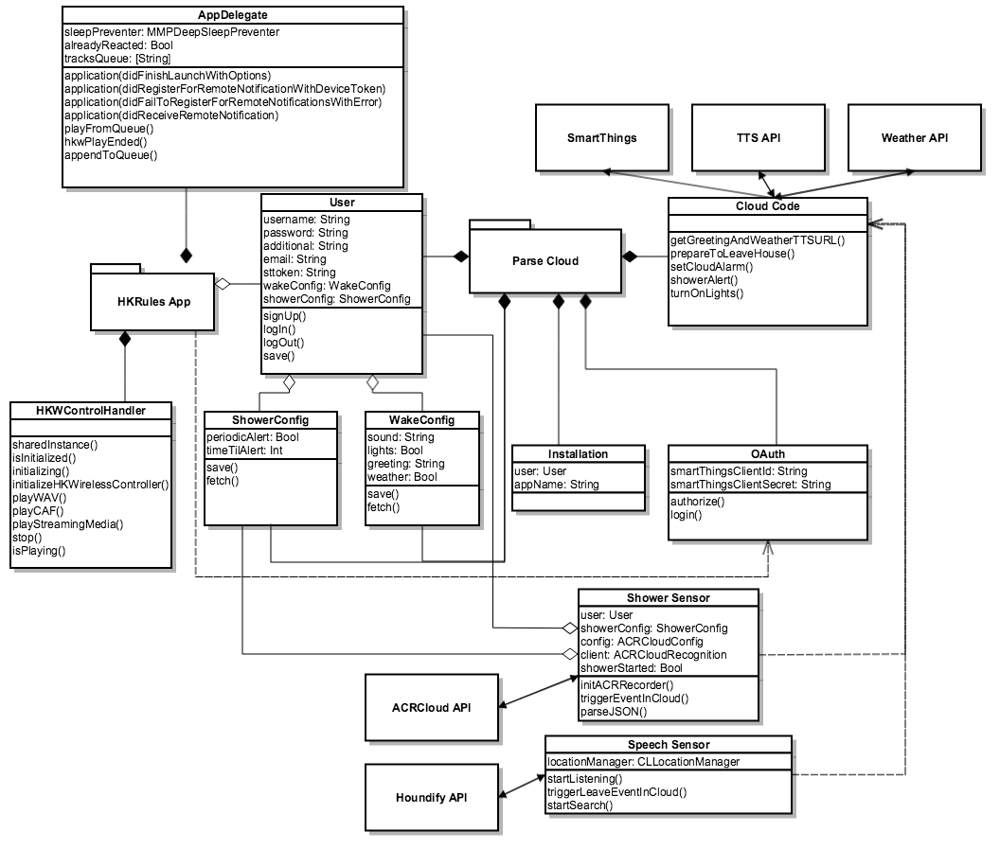

Overview of Classes
===================

The three main scenarios that demonstrate Harman's integration into the IoT space are:

* Wake Up
* Take a Shower
* Leave the Home

The classes we designed and created all pertain to one or more of these scenarios. We hope it's clear how each class is connected entirely to this project, but if it isn't, please definitely continue reading!

HK Rules Application 
~~~~~~~~~~~~~~~~~~~~

The HK Rules iOS application allows the user to configure their preferences regarding each scenario. These preferences are stored in the Parse Cloud associated with a "User" object that represents the actual person using the HK Rules app. The user configures their "Wake Up" preferences in a "WakeConfig" object and their "Take a Shower" preferences in a "ShowerConfig" object.

HK Rules also controls the Harman speakers through the HKWControlHandler, from the HK Wireless SDK. Whenever we needed the speakers to play something, whether it was a Text-To-Speech weather update or a song as an alarm, the HK Rules app handles that. 

Parse Platform
~~~~~~~~~~~~~~

Parse notifies the user of events occuring in the home through push notifications. These notifications are sent to the HK Rules app, which handles them in the AppDelegate. The AppDelegate then activates the speakers accordingly.

The Parse Cloud also allows the HK Rules system to integrate with other services, such as weather updates, text-to-speech, and other IoT platforms like `SmartThings <http://www.smartthings.com/developers/>`__. The way that Parse interacts with these third parties is through "Cloud Code".

External Sensors
~~~~~~~~~~~~~~~~

Parse is notified of events occuring in the home through external sensors. The sensors in the demo are the "Shower Sensor" and the "Speech Sensor". 

Since we didn't have an actual "Shower Sensor", we wrote an iOS application that emulated one. We spent days on different approaches, from checking FFT plots, to trying to detect ambient white noise in the background. We settled on using a sound fingerprinting platform as a basis for the application. 

How it works is the "Shower Sensor" detects when a shower is running by using the ACRCloud API to capture audio from the environment and check if it is representative of a shower. For audio comparsion, we used an mp3 file of a shower downloaded directly from youtube. If the sound from the microphone captured is equal to the mp3 file, we knew it was a shower and could start the timer. 

The "Speech Sensor" is a voice recognition iOS application that we wrote ourselves as well. It uses the Houndify API to recognize speech and convert it to usable data. Our sensor looked for specific phrases that we hardcoded in the application; specifically "I'm leaving", "I am leaving", or "I'm leaving now". Once it recognizes one of these phrases, the application would trigger an event in the cloud automatically. Something cool that we did not have time to implement, but would have loved to have was something like "Smart Phrase Learning", where if you say anything along the lines of depature of the home, it would trigger the event. 

Class Diagram
~~~~~~~~~~~~~

Below is an diagram of all the different classes we designed for the demo: 

**Have trouble reading the diagram?** `Click Here! <http://hkiotdemo.readthedocs.org/en/latest/_images/hkrulesmoduleclassdiagram.png>`__ 