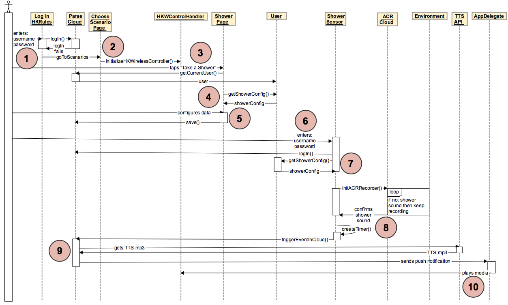

Shower Scenario
================

1. The user enters their username and password into the "Log In" page in the HK Rules iOS app, which logs the user in on the Parse side.

2. The user is then directed to the "Choose Scenarios" page which initializes the HKWControlHandler object.

3. The user then taps "Take a Shower" and is directed to the "Shower" page.

4. The currentUser "User" object is retrieved, which returns a "ShowerConfig" object with it.

5. The user configures their preferences for the Shower scenario: how long they want to shower and whether they want periodic alerts.

6. The user then logs into the Shower Sensor so that the Shower Sensor can know what the user's shower preferences are (by retrieving them from Parse), and also which user to send the Shower alert to.

7. The shower sensor then retrieves the user's shower preferences in a ShowerConfig object from Parse.

8. The shower sensor begins listening to the environment, and sends a packet of sound data to the ACR Cloud for analysis. If the data resembles a shower sound, then the ACR Cloud sends back a positive response, which activates a timer on the shower sensor. The shower sensor keeps listening to the environment and sending data to ACR Cloud for analysis for the duration of the timer. If the shower sound is still playing before the timer runs out, the shower sensor sends an event to Parse which will trigger a shower alert.

9. If Parse receives a notification from the shower sensor that the shower is running longer than the user had configured, it will send a push notification t