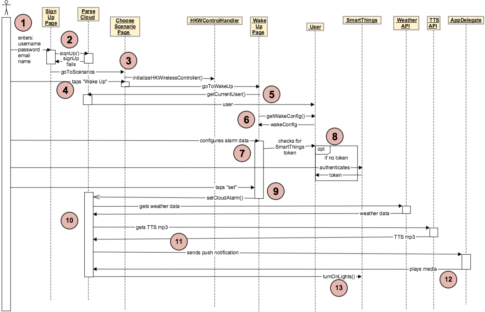

Wake Up Scenario
================

1. The user fires up the HK Rules iOS app and enters their username, password, email, and name into the "Sign Up" page.

2. The "Sign Up" page signs the user up in the Parse Cloud to create their "HK Rules account", which creates a "User" object representing that user. If the sign-up fails, the user is redirected back to the "Sign Up" page.

3. If the sign-up is successful, the user is directed to the "Choose Scenario" pages, which initializes the HKWControlHandler object.

4. On the "Choose Scenario" page, the user taps "Wake Up", which brings them to the "Wake Up" page.

5. The "Wake Up" page requests the currentUser from Parse.

6. The "Wake Up" page queries the currentUser for the WakeConfig object.

7. The user then configures the wakeConfig alarm data.

8. If the user chooses the "Turn on lights" option for their alarm, the "Wake Up" page checks to see if the currentUser User object has a SmartThings token. If it doesn't, then the user is redirected to SmartThings where they can authenticate their SmartThings account and gain a token for future control of their SmartThings devices.

9. Once the user has configured all their alarm settings, he or she taps "Set", which will trigger the "setCloudAlarm()" function on the Parse Cloud.

10. During the "setCloudAlarm()" function, the Parse Cloud gets weather and TTS data from external APIs to send back to the user during the alarm.

11. At the designated alarm time, Parse sends a push notification to AppDelegate running in the HK Rules app on the user's iOS device, with all the configuration data concerning the alarm (alarm sound, weather/tts data, etc.).

12. When the AppDelegate receives the push notification, it tells the HKWControlHandler to play the alarm media through the Harman speakers.

13. When Parse sends the push notification, it also tells the SmartThings platform to turn on the user's lights (using the User's SmartThings authentication token from step 8).